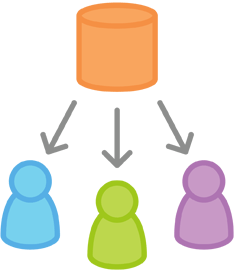
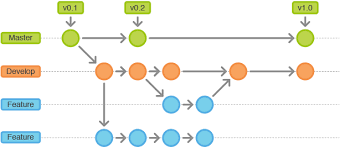
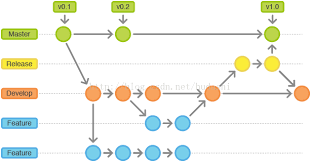

A brief Introduction to Git Workflow
=====================
Author: 裘鹏泽
 
Date: 2017/10/27
  
# What is Git Workflow
>A Git Workflow is a recipe or recommendation for how to use Git to accomplish work in a consistent and productive manner.
--https://www.atlassian.com/git/tutorials/comparing-workflows

 In the process of development, developer has to manage project and collaborate with other developers. How to apply change flow, and keep every one on the same page are implemented in git workflow.
  
 There are some optional workflows for project development. It is okay for you to design a workflow which fits you or your team.
  
  
# Why
**Efficiency**
 
To make development more efficient both for individuals and team.
**Consistence**
 
Keep every developer on the same page.
# How
To practice git workflow, branch is rather important and powerful. Every project has a unique branch, master branch. Different workflows have different featured brenches, such as feature branch, develop branch.
 
There are many patterns for you to choose.
* Centralized Workflow
* Feature branch Workflow
* Gitflow Workflow
* Forking Workflow

## Centralized Workflow

Centralized management is quite similiar to SVN. First, initialize a cetral repository, and every developer clone a copy onto local disk.

    git clone ssh://user@host/path/to/repo.git

Then every one develops and commits changes on their local copy, isolated from central repository.
  
    git add \<file\>
    git commit -m "Commit message"

Finally, when all changes finally will be pushed to central repository. Probably, some one has pushed their fruits onto centralized repository. 

    git push origin master

In that case, you have to rebase your local copy and solve potential conflicts before pushing yours.

    git pull --rebase origin master

## Feature branch Workflow
What makes it different from centralized workflow is that it puts each feature development on a dedicated branch. Developers can focus on their own feature without disturb main base, and other features push won't disturb their push. 
This make master codes always complete. Once feature development is completed, after code review, developers can merge feature branch into master branch

## Gitflow Workflow
Introduced Vincent Driessen at nvie in a blog, it neither adds new concepts nor commands comparing to feature branch workflow. Instead, it assigns specific roles for different branchs and how different branch interact.
 
Once the project is launched, two branches, master and develop, exists.
Master branch contains official release of each version, while develop contains daily progress.
 

  
Feature branches are branched off develop branch. Once a feature is completed, it will be merged into develop branch. Feature branches shouldn't interact with master branch.
 

  
Release branches are also branched off develop branch. Once develop acquires enough features or release date approaches, release branch is forked off develop. Developer only do bug fix, document generation and other release-oriented task in release branch. Release branch will be merged into master branch when it is time, tagging a new version on master branch. In addition, release branch will be merged into develop branch.
 

 

## Forking Workflow
Forking gives each developer a server-side repository and a private local one. Developers can work on their own private local one. When some features are prepared, developers can send a pull request for others to consider merging into server repository.
 
___________________________________________
# Reference
1. https://www.atlassian.com/git/tutorials/comparing-workflows
2. https://www.atlassian.com/git/tutorials/comparing-workflows/gitflow-workflow
3. https://github.com/xirong/my-git/blob/master/git-workflow-tutorial.md#211-工作方式
  
**Thanks to all contributed to this documents**